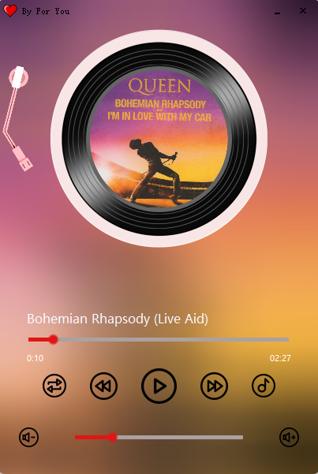

# Qt实现的音乐播放器

windows平台下基于Qt Creator 4.11.1实现的类网易云移动端播放界面的音乐播放器。

使用时请取消Shadow build 好让程序能够找到资源文件。

guthub:https://github.com/ZzBobo0915/Qt/tree/main/MusciPlayer

- 实现了根据歌曲播放、暂停、上一首、下一首、播放模式（单曲循环、随机播放、队列循环）、歌词显示、歌曲进度改变（滑动条）、音量增大和音量减小（按钮与滑动条）、关闭提示等基本功能
- 实现了黑胶底片和摇杆的动态改变
- 实现了根据打开播放器的时间来实现系统菜单栏显示 
- 实现了高斯模糊背景的实现
- 整个程序的UI布局全部使用代码书写，没有使用到Qt设计师工具

## 标题栏titlewindow.h/cpp

- 最小化
- 最大化（没用上）
- 关闭
- 鼠标界面拖动

## 高斯模糊gaussianbur.h

​    对背景图片进行高斯模糊处理，高斯模糊原理参考https://blog.csdn.net/mahabharata_/article/details/69066942

## 缓存背景图片子线程cachethread.h/cpp

​    创建子线程用来缓存背景图片，对音乐列表中的每一个碟片进行高斯模型并保存在cache文件中。

## 基类主窗口basiwindow.h/cpp

- 阴影窗口
- 设置窗口圆角
- 自定义背景

## 胶片、摇杆区域mylovewindow.h/cpp

- 胶片的动态转动
- 摇杆的改变

## 处理歌词、播放时间的子线程thread.h/cpp

- 歌词的动态改变
- 播放时间的动态改变

## 主窗口dialog.h/cpp

​    继承自basiwindow.h把功能都集成到一起，并设计UI布局。
